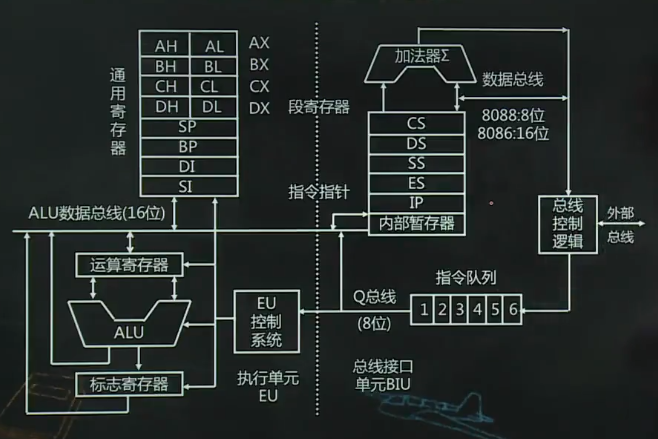
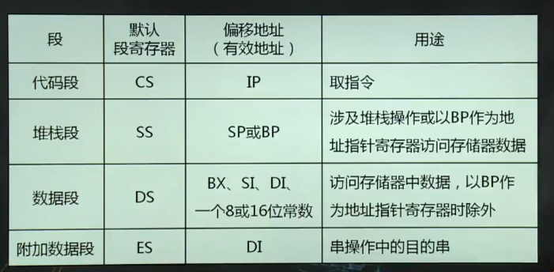
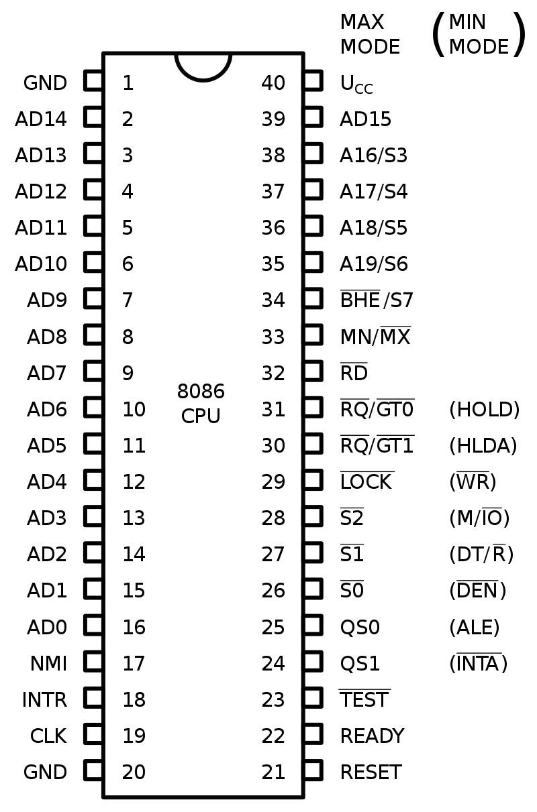
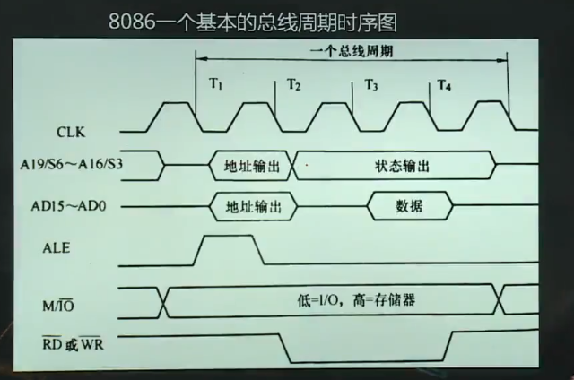

# 8086微处理器

1.  [8086微处理器内部结构](#8086微处理器内部结构)
2.  [8086的基本执行环境](#8086的基本执行环境)
3.  [8086的引脚信号](#8086的引脚信号)
4.  [8086的基本时序](#8086的基本时序)

## 8086微处理器内部结构

8086组成：算术逻辑单元，累加器，专用和通用寄存器，指令寄存器，指令译码器，定时和控制电路。

*   总线接口单元（BIU）：4个段寄存器，一个指令寄存器，一个与EU通信的内部暂存器，先入先出队列，总线控制逻辑，加法器。负责与存储器及I/O传送消息。
*   执行单元（EU）：8个通用寄存器，1个标志寄存器，算术逻辑单元，EU控制电路。EU从指令队列中取出指令代码，将其译码，发出控制信号。
*   BIU和EU相互独立，并行工作。

8086和8088内部结构上的异同点：

*   相同点：均由BIU和EU组成，两部件并行工作；内部数据总线都是16位。
*   不同点：8086指令队列有6字节，而8088只有4字节；8086指令队列空出2字节则BIU执行一次取指令，而8088则是空出1字节便执行一次取指令；8086的外部数据总线是16位，而8088只有8位。

## 8086的基本执行环境

内部寄存器（14个16位寄存器）：8个通用寄存器，4个段寄存器，1一个指令寄存器，1个标志寄存器。

*   通用寄存器：数据寄存器（AX累加器，BX基地址寄存器，CX计数寄存器，DX数据寄存器）；地址寄存器（SP，BP）；变址寄存器（SI和DI）。
*   段寄存器（CS代码段，SS堆栈段，DS数据段，ES附加段）。
*   指令寄存器（IP）。
*   标志寄存器（FLAGS）：
    *   CF——进位标志（Carry Flag）。若CF=1，表示算术运算时产生进位或借位，否则CF=0。移位指令会影响CF。
    *   PF——奇偶标志（Parity Flag）。若PF=1，表示操作结果中“1”的个数为偶数，否则PF=0。这个标志位主要用于检查数据传送过程中的错误。
    *   ZF——全零标志（Zero Flag）。若ZF=1，表示操作结果全为零，否则ZF=0。
    *   SF——符号标志（Sign Flag）。若SF=1，表示符号数运算后的结果为负数，否则SF=0。
    *   OF——溢出标志（Overflow Flag）。若OF=1，表示当进行算术运算时，结果超过了最大范围，否则OF=0。
*   

8086的存储器管理：

*   内存单元：即存储器中1个字节的存储区域。
*   内存容量：8086共20条地址线，为1M的容量大小。
*   8086的寄存器为16位，寻址范围是64kb。
*   逻辑地址：段基址：编译地址。物理地址：段基址 x 10H + 偏移地址。

多字节数据的存放：

*   小端存储法：对于多字节数据，低字节存放在低地址，高字节存放在高地址。多字节数据的地址是最低字节的地址。

## 8086的引脚信号

8086的工作方式（由MN/$\overline{MX}$引脚控制）：

*   最小方式：系统只有一个8086微处理器。
*   最大方式：系统中含有两个以上的主线总设备，8086为主处理器，其他为协处理器（8087，8089）。

8086的引脚（40引脚双列直插式封装）：20根地址线，16根数据线，控制线，状态线，时钟线，电源线，地线。一线多用技术。

## 8086的基本时序

周期：

*   时钟周期：计算机在时钟脉冲的统一控制下，一个节拍一个节拍地工作。这个时钟脉冲由时钟振荡器产生，每两个时钟脉冲上升沿之间的时间间隔称为T状态，或时钟周期。微处理器动作的最小时间单位。
*   总线周期：CPU通过总线与存储器或输入/输出端口间进行一次数据传输所需花费的时间。一个总线周期包含了4个时钟周期。
*   
*   指令周期：执行一条指令所需的时间。不同指令的指令周期不同，为1~n个总线周期。
