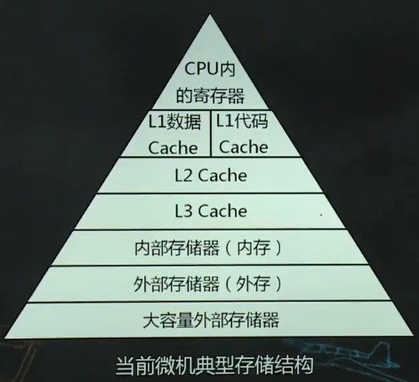
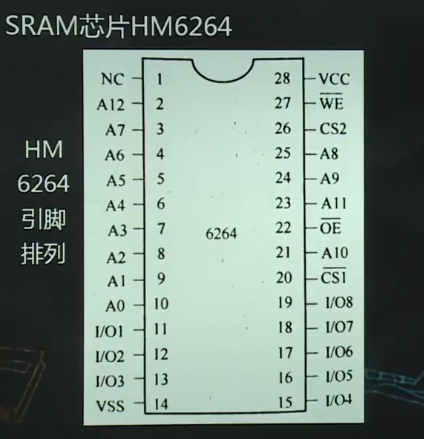
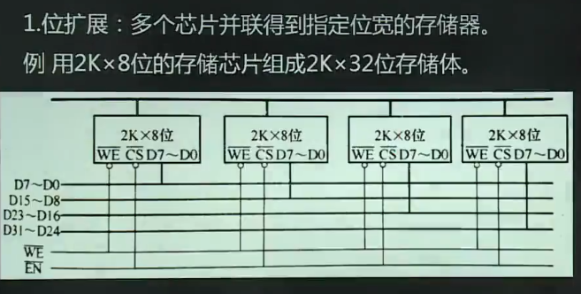
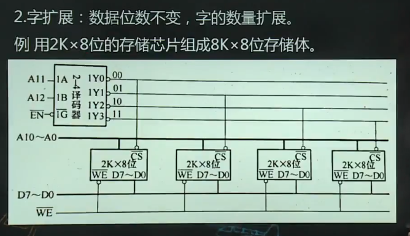
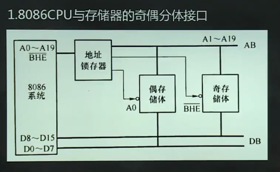
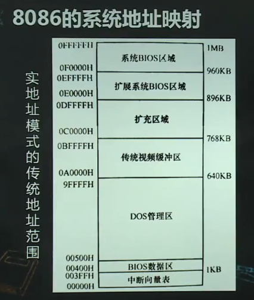

# 内部存储器及其接口

1.  [存储器分类及其层次结构](#存储器分类及其层次结构)
2.  [半导体存储器](#半导体存储器)
3.  [半导体存储器与CPU的连接](#半导体存储器与cpu的连接)
4.  [8086CPU与存储器的连接](#8086cpu与存储器的连接)
5.  [8086的系统地址映射](#8086的系统地址映射)

## 存储器分类及其层次结构

存储器分类：

*   储存器存放：程序和数据。
*   根据存储器放置的位置进行分类：通用寄存器，高速缓存，内部存储器，外部存储器。
*   根据存储介质进行分类：半导体存储器，磁存储器，光存储器。
*   根据信息的存储方式进行分类：只读存储器，随机存取存储器，顺序存储器。

存储器的层次结构：

*   
*   采用层次结构的原因：在大容量，高速度，低成本见找到一种平衡。
*   工作原理：程序和数据首先保存在外存，程序要运行时，会将其及相关数据调到内存；由于程序局部性特点，最近使用的数据和程序段会保留在cache中；cache中的数据在参与运算时，有些调入到CPU的寄存器中，cache的代码调入到CPU中的指令缓冲。

## 半导体存储器

半导体存储器的基本结构：地址寄存器，地址译码器，存储体，读/写电路，数据寄存器，控制/时序逻辑。

半导体存储器分类：

*   只读存储器ROM：数据只能读出，不能改变；掉电不丢失。可编程ROM（PROM），可擦除ROM（EPROM），电可擦除可编程ROM（EEPROM），闪烁存储器（Flash）。
*   随机存取存储器RAM：可对数据进行读/写操作，读写速度比ROM快，掉电丢失。SRAM（采用触发器存储信息），DRAM（采用电容存储信息）。

内存的主要性能指标：

*   存储容量：K位地址线，L位数据线的存储芯片容量为2k x L位。
*   存取时间：CPU给出有效地址，启动一次存储器读/写操作，到操作完成所经历的时间。
*   存取周期：连续启动两次独立的存储器读/写所需的最小时间间隔。存储器读出数据之后，需要一个恢复时间完成内部操作。存取周期=存取时间+恢复时间。
*   可靠性。
*   性价比。

典型的半导体存储器芯片：

## 半导体存储器与CPU的连接

存储器芯片与CPU连接中应关注的问题：

*   CPU的负载能力：外接芯片的数量，驱动器，缓冲器。
*   芯片的选择：考虑芯片的容量，总存储容量，时序匹配等。
*   时序配合：存储芯片的速度和CPU读/写时序相匹配。
*   存储器的地址分配：RAM的用户区存放程序和数据，单芯片容量有限，多芯片组成存储器需要考虑片选，地址分配。

存储器扩展：位扩展，字扩展，字位扩展。

*   
*   

实现片选控制的方法：存储体是由多个芯片构成，由片选信号（由地址线实现）决定对哪一个芯片进行读写操作。

*   全译码法
*   部分译码法
*   线选法

## 8086CPU与存储器的连接

8086CPU与存储器采用奇偶分体接口：20根地址线，寻址范围1MB。1MB分成2个512KB，偶存储体，奇存储体，均8位宽。

## 8086的系统地址映射

