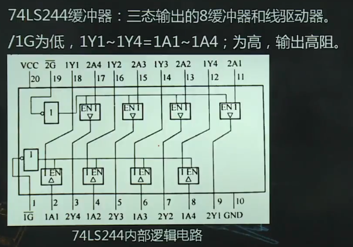

# 输入/输出与接口技术

1.  [I/O接口概述](#io接口概述)
2.  [I/O端口编址](#io端口编址)
3.  [8086最小系统简单接口电路](#8086最小系统简单接口电路)
4.  [I/O数据传送的控制方法](#io数据传送的控制方式)

## I/O接口概述

接口的概念和种类：

*   接口：CPU与内存及CPU与外部设备之间通过总线进行连接的逻辑部件（电路），前者称为存储器接口，后者称为I/O接口。
*   I/O设备不能和微机内部直接连接，必须通过I/O接口进行信息交换：二者间的信息类型和格式不同；二者速度不匹配；多个I/O设备会降低CPU效率；会使其I/O硬件依赖CPU，不利其发展。

I/O接口的基本功能：作为微机与I/O设备传递数据的缓冲；对I/O设备进行寻址；信号转换。即，完成数据，地址和控制三总线的转换和连接任务。

I/O接口的组成：接口硬件（数据缓冲器，控制寄存器，状态寄存器，总线缓冲器，端口地址译码器）和接口软件（设备驱动程序）。

## I/O端口编址

I/O端口：接口中供CPU直接存取访问的一些寄存器或特定的硬件电路。输入端口、输出端口和双向端口。

I/O端口地址（地址线高位，地址线地位）：接口基地址+端口号。

*   I/O端口编址方式：I/O统一编址，I/O独立编址。

## 8086最小系统简单接口电路

I/O接口电路的分类：

*   按功能选择的灵活性：
    *   不可编程接口芯片：74LS373（锁存器），74LS244（缓冲器），74LS245（数据收发器）。
    *   可编程接口芯片：8254，8255，8259。
*   按接口的通用性：
    *   通用接口芯片：8254，8255，8259。
    *   专用接口芯片：配置键盘、显示器等复杂外设。

3种简单的I/O接口芯片：

*   
*   
*   

8086与3个简单I/O接口芯片的应用举例：

*   
*   
*   

```asm
;led亮灯或开关闭合都是值为0
;使led循环亮灯1小时
  mov cx, 3600
  mov al, 11111110B ;初始化亮灯LED1
LP:
  out 50h, al       ;假设译码器端口号为50h
  call delays       ;延时1秒
  rol al, 1         ;循环左移一位
  loop lp
  mov ax, 4c00h
  int 21h
```

## I/O数据传送的控制方式

程序控制传送方式：以CPU为中心，数据传送的控制来自CPU，通过预先编译好的输入输出程序实现数据的传送。速度低，传送路径经过CPU内部寄存器，数据输入/输出相应比较慢。

*   无条件传送方式：简单，输入时假设设备数据已经准备好，输出时假设输出设备已经空闲。
*   查询传送方式：CPU传送数据之前，主动查询外设是否就绪，若没有就绪，则继续查询其状态，直至外设就绪。
*   中断传送方式：CPU和I/O设备并行工作。无需反复查询外设状态，当外设准备好后，主动向CPU请求中断，CPU相应这一请求，暂停正在执行的程序，传入数据传送的中断服务子程序，完成后自动返回原来运行的程序。

DMA（直接存储区存取）：数据传送不经过CPU，由DMA控制器实现内存与外设间的直接快速传送。
