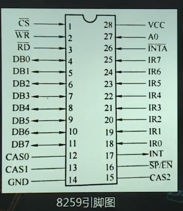
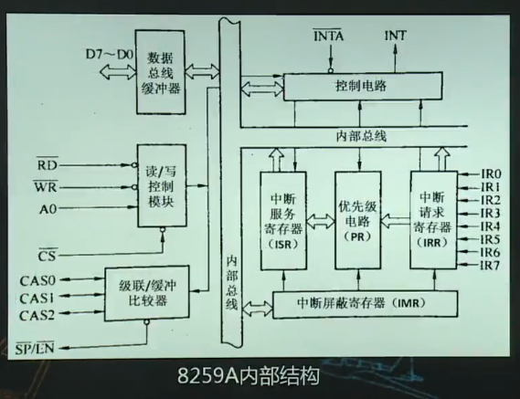

# 中断系统

1.  [中断系统概述](#中断系统概述)
2.  [8086的中断系统](#8086的中断系统)
3.  [可编程中断控制器8259A](#可编程中断控制器8259a)
4.  [8086中断处理程序的设计](#8086中断处理程序的设计)

## 中断系统概述

中断的概念：

*   中断：CPU暂停正在执行的程序，转而处理随机事件，处理完后再回到被中断的程序。
*   中断源：能引发CPU中断的来源。外部硬件中断，内部中断。
*   中断系统基本功能：对中断请求的屏蔽和开放；中断级别设定；中断嵌套；自动进行中断处理，并自动返回。

I/O接口中中断的控制电路：

*   在1对多连接下中断源的识别和优先级判断法（8086采用1对多）：软件查询法，硬件查询法，请求线仲裁法。

## 8086的中断系统

外部中断：即外部中断源通过中断请求引脚发出的中断。

*   可屏蔽中断（INTR引脚）。
*   不可屏蔽中断（NMI引脚）。

内部中断：由于指令调用，或指令运行过程中出现错误或者其他不正常情况而产生的中断。

8086中断系统中断相应与处理过程：

*   中断到来，CPU先判断中断请求类型：若为NMI则执行完当前指令后立即响应中断处理程序；若为INTR则先判断IF，若为1则停止当前主程序转而处理中断事件。
*   可屏蔽中断响应和处理过程：
    *   外设申请中断；8086发出中断响应信号（$\overline{INTA}$）；中断识别；保护断点；转入中断处理程序；保护寄存器数据；完成中断功能；恢复寄存器内容；返回断点。
    *   1到5硬件自动完成；6到8通过程序指令完成；9需要使用IRET指令，但执行由硬件自动完成；通过中断向量表获取中断处理程序的入口地址。

中断向量和中断向量表：

*   中断类型号：每个8086中断都被分配唯一的识别号。
*   中断向量：每个中断处理程序都有一个入口地址。
*   中断向量表：所有的中断处理程序入口地址都被放到中断向量表中。该表位于内存0000:0000起始的1KB范围内。每个中断向量CS:IP占4个字节，共256种。

## 可编程中断控制器8259A





8259A的主要工作方式：

*   中断触发的方式：边沿触发，电平触发。
*   屏蔽中断源的方法：通常屏蔽字，特殊屏蔽字。
*   优先级排序的方法：固定优先级（IR0最高，IR7最低），优先级轮转法。
*   中断嵌套方式：全嵌套，特殊全嵌套。

8259A的命令：

*   初始化命令（ICW1~ICW4）。
*   操作命令（OCW1-OCW3）。

```asm
intm00 equ 020h   ;8259A端口0
intm01 equ 021h   ;8259A端口1
mov al, 00010011B ;ICW1：边沿触发，要ICW4，单片方式，不要ICW3
out intm00, al
jmp short $+2     ;跳转到下一条语句，延时用（主要是延时几微秒给端口一个反应时间）
mov al, 00001000B ;ICW2：起始中断类型号08H
out intm01, al
jmp short $+2
mov al, 00000001B ;ICW4非缓冲器，全嵌套，正常中断结束
out intm01, al
jmp short $+2
```

## 8086中断处理程序的设计

设计步骤：

1.  使用正确的中断号。
2.  中断向量的置换。
3.  适当保护现场。
4.  避免在中断处理程序中调用DOS功能。
5.  正确估计中断处理程序的执行时间。
6.  适当的时候打开中断。
