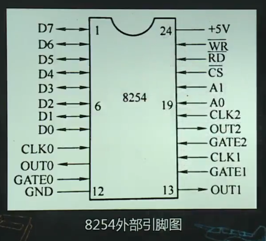
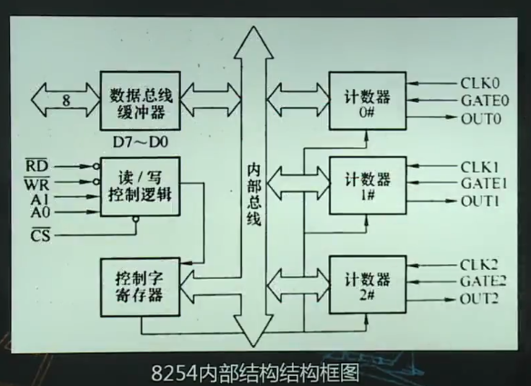
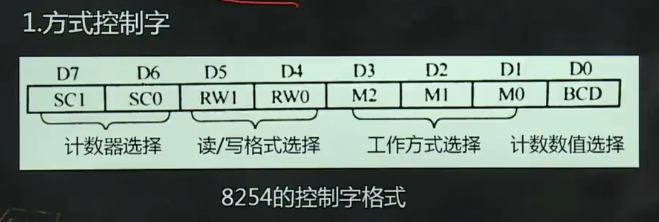
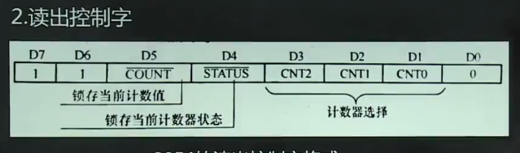
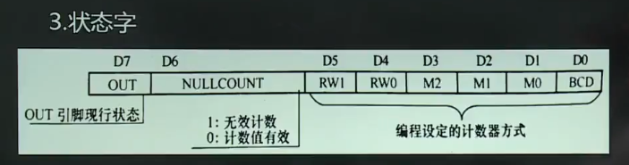

# 可编程定时计数器

1.  [定时计数器概述](#定时计数器概述)
2.  [可编程定时/计数器8254](#可编程定时计数器8254)
3.  [8254的应用](#8254的应用)

## 定时/计数器概述

微机系统中，定时/计数的功能主要包括：以均匀分布的时间间隔中断分时操作系统以切换程序；向I/O设备输出精确的定时信号，如读键盘时延迟去抖；检测外部事件发生的频率或周期，如CPU风扇转速测量；统计外部某过程中某一事件发生的次数，如高速公路上车流量的统计等。

定时方法：软件方法，不可编程硬件定时，可编程硬件定时。

## 可编程定时/计数器8254

8254的基本功能：由3个独立的16位计数器；每个计数器可编程工作于6种不同工作方式；8254有读回命令（8253没有），除了可以读出当前计数单元内容外，还能读出状态寄存器内容。





8254的工作方式：先写控制字至控制字寄存器，以选择工作方式；在向CR写入计数初值。

*   方式2和方式3初值自动重装。
*   方式0和方式5硬件触发。
*   方式1和方式4软件触发。

8254的控制字：

*   方式控制字（设置计数器的工作方式）：

    

*   读回控制字（设置读回命令）：

    

*   状态字：

    

8254的编程：

*   初始化编程：

    ```asm
    ;问：试使用8254计数器0做频率4khz的方波发生器，8254的端口地址为40h~43h，f=12Mkz
    mov al, 00110111B  ;计数器0，读写方式11，工作方式3，BCD格式
    out 43, al
    mov ax, 3000h      ;为计数器0送初值
    out 40h, al        ;先送低8位
    mov al, ah
    out 40h, al        ;再送高8位
    ```

*   工作编程：

    ```asm
    ;问：设8254端口地址为40h~43h，试读出计数器2的当前计数值
    mov al, 10000000B  ;D3~D0为任意
    out 43h, al        ;锁存计数器2当前计数值
    in al, 42h         ;读计数器2的当前计数值低8位
    mov ah, al
    in al, 42h         ;读计数器2的当前计数值高8位
    xchg ah, al        ;交换高低位，使ax中为计数器2当前计数值
    ```

## 8254的应用

8254的CLK0的时钟频率为8khz，问：

*   T/C0最大定时时间是多少？

    ```txt
    1/8khz = 0.125ms
    65536*0.125ms = 8.192s
    ```

*   如果8254端口地址为90h，92h，94h，96h，现在要使得该8254产生周期为9s，占空比4:9的方波，请完成电路，编写初始化程序。

    ```asm
    mov al, 00110111B  ;0号计数器，方式3，十进制
    out 96h, al
    mov ax, 8000h
    out 90h, al        ;向计数器0送初值，产生1hz的方波
    mvo al, ah
    out 90h, al
    mov al, 01010111B  ;计数器1，只写低8位初值，方式3，十进制
    out 96h, al
    mov al, 9h
    out 92h, al
    ```
