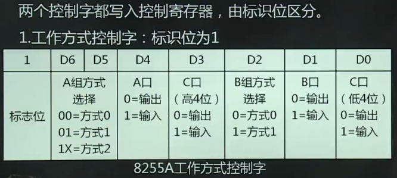
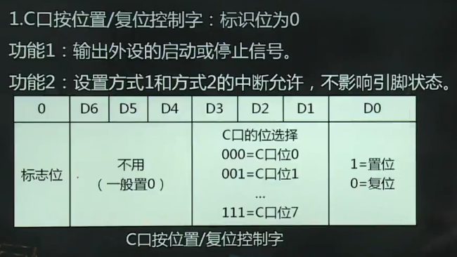

# 可编程并行接口

1.  [并行接口概述](#并行接口概述)
2.  [可编程并行接口芯片8255a](#可编程并行接口芯片8255a)

## 并行接口概述

并行接口：传送数据单位为字或字节，需要多根数据线，各位同时传送，如打印机接口。

串行接口：传送数据单位为位，用一根数据线，一次传输一个位，如USB。

远距离传输：串行接口；近距离传输：并行接口。

## 可编程并行接口芯片8255A

8255A的基本功能：

*   2个独立的8位I/O口（A和B）和两个独立的4位I/O口（C上和C下）。作输入时有三态缓冲器的功能，做输出时有数据锁存的功能。
*   三种工作方式。
*   A口双向，B和C适合做输出。

8255A的工作方式：

*   方式0（简单的输入/输出方式）：不需要应答式联络信号，即无条件传送。通常将A和B口作为数据口，将C口高4位或低4位作为输出口，输出控制信号，C口的另4位作为输入口，读入外设状态。
*   方式1（选通的输入/输出方式）:需要应答式联络信号。A口，B口均可工作在此方式，作为两个独立的8位I/O数据通道，C口需6位（分成两个3位）分别作为A和B口的应答联络线，其余2位可作为方式0的输入/输出。
*   方式2（双向选通I/O方式）：仅A口工作在此方式。

8255A的控制字与初始化编程：

*   
*   
