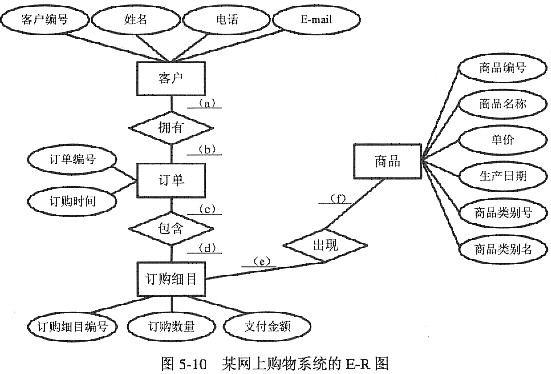

# 数据库系统概述

1.  [数据库基本概念](#数据库基本概念)
2.  [数据库管理技术的发展](#数据库管理技术的发展)
3.  [数据库系统的结构](#数据库系统的结构)
4.  [数据模型](#数据模型)

## 数据库基本概念

数据（Data）是描述事物的符号记录，是指用物理符号记录下来的、可以鉴别的信息。数据的含义称为数据的语义。

数据库（Database）是长期存储在计算机内、有组织的、可共享的大量数据集合。

数据库管理系统（DBMS）是位于用户与操作系统之间的一层数据管理软件。

*   DBMS的主要功能：
    *   数据定义功能
    *   数据操纵功能
    *   数据库的运行管理。
    *   数据库的建立和维护。

数据库系统（DBS）是指在计算机系统中引入数据库后的系统构成。

*   数据库系统的构成：由数据库、数据库管理系统（及其开发工具）、应用系统、数据库管理员（和用户）构成。

数据库的特点：

*   数据的管理者：DBMS。
*   数据面向的对象：现实世界。
*   数据的共享程度：共享性高。
*   数据的独立性：高度的物理独立性和一定的逻辑独立性。
*   数据的结构化：整体结构化。
*   数据控制能力：由DBMS统一管理和控制。

## 数据库管理技术的发展

数据管理技术经历了人工管理、文件系统、数据库系统三个阶段。

人工管理阶段：记录内无结构，整体无结构。

文件系统阶段：数据可长期保存；共享性差，冗余度大；记录内有结构，整体无结构。

数据库系统阶段：数据集成，数据共享性高，数据冗余度小，数据一致性，数据独立性高，实施统一管理与控制。

## 数据库系统的结构

模式也称为概念模式或逻辑模式，它是数据库中全体数据的逻辑结构和特征的描述，是所有用户的公共数据视图。

外模式也称为子模式或用户模式，它是数据库用户能够看到和使用的局部数据的逻辑结构和特征的描述。

内模式也称为存储模式，它是对数据库中数据物理结构和存储方式的描述，是数据在数据库内部的表示形式。

三级模式结构的两层映像与数据独立性：

*   外模式/模式映像（逻辑独立性）。
*   模式/内模式映像（物理独立性）。

数据库系统的运行和应用结构：

*   客户/服务器（Client/Server）模式。
*   浏览器/服务器（Browser/Server）模式。

## 数据模型

数据模型：

*   概念模型：也称信息模型。它是按用户的观点来对数据和信息建模，与具体的计算机系统无关，主要用于数据库设计。
*   逻辑模型：主要包含网状模型，层次模型，关系模型等，它是按照计算机系统的观点对数据建模。
*   物理模型：是对数据最底层的抽象，描述数据在系统内部的表示方式和存取方法，在磁盘或磁带上的存储方法和存取方法，是面向计算机系统的。
*   数据模型是数据库系统的核心和基础。

数据模型的组成要素：

*   数据结构：描述数据库的组成对象及对象之间的联系。
*   数据操作：是指数据库中各种对象的实例允许执行的操作的集合，包括操作及其有关操作规则。
*   数据的约束条件：一组完整性规则的集合。完整性规则是给定的数据模型中数据及其联系所具有的制约和存储规则。

概念模型：

*   信息世界中的基本概念：
    *   实体（Entity）：客观存在并可相互区别的事物称为实体。
    *   属性（Attribute）：实体所具有的某一特性称为属性。
    *   码或键（Key）：唯一标识实体的属性集称为码。
    *   域（Domain）：属性的取值范围称为该属性的域。
    *   实体型（Entity Type），实体集（Entity Set）。
    *   联系（Relationship）：现实世界中事物内部以及事物之间的联系在信息世界中反映为实体内部的联系和实体之间的联系。
*   概念模型的表示方法：实体-联系方法（E-R方法）。
    *   用E-R图来描述现实世界的概念模型，它提供了表示实体型、属性和联系的方法。
    *   

逻辑模型：

*   层次模型（树）：
    *   满足下面连个条件的基本层次联系的集合为层次模型：
        *   有且只有一个结点没有双亲结点，这个结点称为根结点。
        *   根以外的其他结点有且只有一个双亲结点。
    *   表示方法：
        *   实体型：用记录类型描述。每个结点表示一个记录类型
        *   属性：用字段描述。每个记录类型可包含若干个字段。
        *   联系：用结点之间的连线表示记录型之间的一对多的联系。
*   网状模型（图）：
    *   满足下面两个条件的基本层次联系的集合为网状模型：
        *   允许一个以上的结点无双亲。
        *   一个结点可以有多于一个的双亲。
    *   表示方法（与层次数据模型相同）。
*   关系模型：关系模型中的数据的逻辑结构是一张二维表。它由行和列组成。
