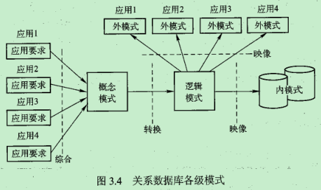

# 数据库设计

1.  [数据库设计概述](#数据库设计概述)
2.  [数据库设计的基础步骤](#数据库设计的基础步骤)
3.  [关系数据库设计方法](#关系数据库设计方法)

## 数据库设计概述

数据库的生命周期：

*   数据库分析和设计阶段：
    *   需求分析。
    *   概念设计。
    *   逻辑设计。
    *   物理设计。
*   数据库实现和操作阶段：
    *   数据库的实现。
    *   操作与监督。
    *   修改与调整。

数据库设计的目标：

*   满足应用功能需求。
*   良好的数据库性能。

数据库设计的内容：

*   数据库结构设计。
*   数据库行为设计。

数据库设计的方法：

*   直观设计法。
*   规范设计法。
*   计算机辅助设计法。

## 数据库设计的基础步骤

需求分析：

*   确定数据库范围：即确定数据库应支持哪些应用功能。
*   应用过程分析：确定要用到的数据，数据的使用顺序，处理的结果。
*   收集与分析数据：了解并分析数据的组成格式及操作特征，每个数据元素的语义及关系等。
*   编写需求分析报告：应用需求的业务人员和数据库设计人员的“共同语言”，能准确的表达应用需求，可读性强，且无二义性，能为数据库的后续阶段设计提供全面、准确和详细的资料。

概念结构设计：在需求分析报告的基础上按照特定的方法设计满足应用需求的用户信息结构（概念模型），可完全不顾及具体的硬件和软件的限制，它是一个符合用户要求的趋于理想化的信息结构。

逻辑结构设计：将概念模型转换为等价的、并为特定DBMS所支持的数据模型（层次、网状、关系）的结构。

物理结构设计：根据指定的逻辑结构，研究并构造物理结构的过程，具体包括确定数据库在存储设备上的存储结构及存取方法，可能还包括建立索引和聚集，以及物理块大小，缓冲区个数，数据压缩的选择等。

数据库实施：加载数据，应用程序设计，数据库试运行。

数据库的运行和维护。

## 关系数据库设计方法

概念结构：建立局部信息结构，并合成全局信息结构和优化（用E-R图作描述工具）。

逻辑结构：把概念设计阶段的E-R图转换为RDBMS支持的数据模型。

物理结构：通过对关系建立索引和聚集来实现与应用相关数据的逻辑连接和物理聚集，以改善对数据库的存取效率。
