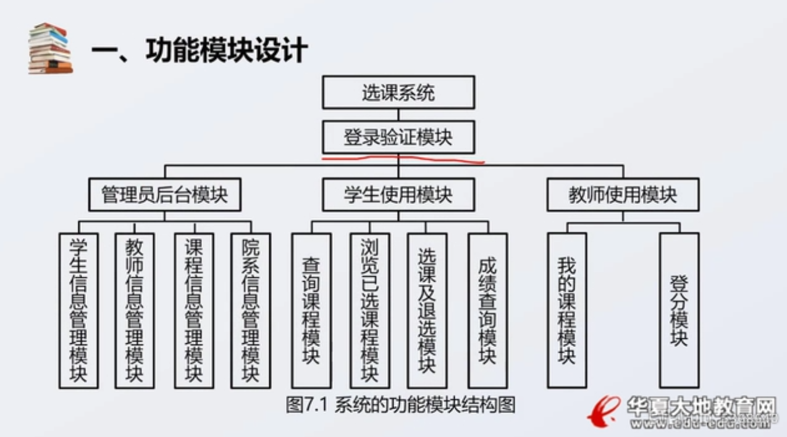
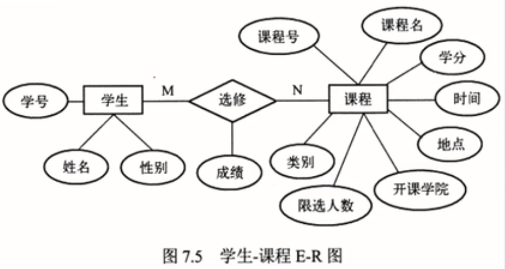
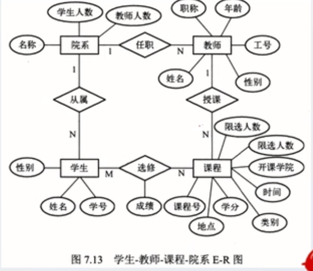
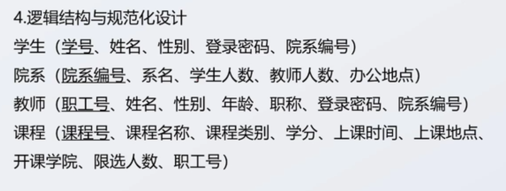

# 数据库应用设计与开发实例

1.  [需求描述与分析](#需求描述与分析)
2.  [系统设计](#系统设计)
3.  [系统实现](#系统实现)
4.  [系统测试与维护](#系统测试与维护)

## 需求描述与分析

示例：选课系统。

功能性需求：

*   管理员后台模板：学生信息管理，教师信息管理，课程信息管理，班级信息管理。
*   学生使用模块：查询课程，浏览所选课程，查询成绩。
*   教师使用模块：我的课程，登分。

非功能性：可靠性，正确性，兼容性，健壮性。

## 系统设计

确定实体：学生，教师，课程，院系。

局部信息结构：

全局信息结构：

逻辑结构与规范化设计：

## 系统实现

1.  创建数据库。
2.  创建表：表中各字段，类型，索引，是否为空，是否自增，说明等需要注意。
3.  通过编写前端，实现整个项目。

## 系统测试与维护

测试：将需要使用到的功能列出表格，运行测试内容，并记录测试结果。
